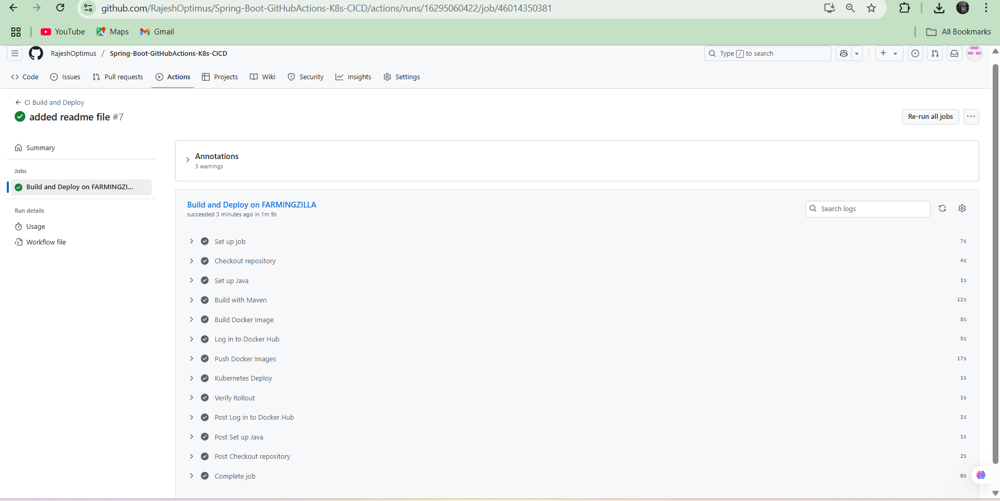
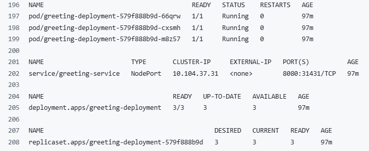
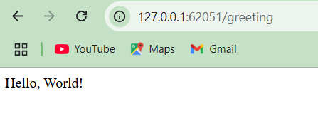
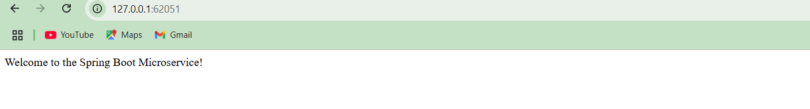

# Spring Boot Microservice CI/CD with GitHub Actions & Kubernetes

This project demonstrates a complete CI/CD pipeline for a Spring Boot microservice using:
- **Docker** for containerization
- **Kubernetes** for orchestration
- **GitHub Actions** with a **self-hosted runner** for automation

---

## 🌟 Features

- RESTful Spring Boot microservice (`/` and `/greeting` endpoints)
- Dockerized application
- Kubernetes manifests (Deployment + Service)
- CI/CD with GitHub Actions (build, test, Docker push, deploy)
- Runs on a self-hosted Windows runner (`FARMINGZILLA`)

---

## 🛠️ Technologies

- Java 17
- Spring Boot
- Maven
- Docker
- Kubernetes
- GitHub Actions

---

## 📁 Project Structure

```text
.
├── src/                   # Java source code
├── k8s/
│   ├── deployment.yaml    # Kubernetes Deployment
│   └── service.yaml       # Kubernetes Service
├── Dockerfile             # Builds container image
├── pom.xml                # Maven configuration
└── .github/
    └── workflows/
        └── ci-cd.yml     # CI/CD workflow
```

---

## 🚀 Getting Started

### 🔧 Prerequisites

- Docker installed
- Kubernetes cluster (e.g. Minikube or Docker Desktop)
- GitHub repo with self-hosted runner connected

---

### ▶️ Run Locally (for testing)

```bash
# Build and run with Maven
mvn clean install
java -jar target/*.jar
```

Access at: `http://localhost:8080/`  
Try endpoint: `http://localhost:8080/greeting`

---

### 🐳 Docker Commands

```bash
# Build image
docker build -t rajeshrajatv/springboot-githubactions-k8s:latest .

# Run container
docker run -p 8080:8080 rajeshrajatv/springboot-githubactions-k8s:latest
```

---

### ☸️ Deploy to Kubernetes

```bash
kubectl apply -f k8s/deployment.yaml
kubectl apply -f k8s/service.yaml
```

Check app:

```bash
kubectl get pods
kubectl get services
```

If using NodePort:

```bash
kubectl port-forward service/greeting-service 8080:8080
```

Then open: [http://localhost:8080](http://localhost:8080)

---

## ⚙️ CI/CD Pipeline

The pipeline is defined in `.github/workflows/deploy.yml`.

### 🔁 It includes:

- Code checkout
- Java setup with Maven build
- Docker image build & push to Docker Hub
- Kubernetes deployment
- Pod and rollout status checks

---

## 🔐 Secrets Used

Set these in GitHub > Settings > Secrets:

- `DOCKER_USERNAME` — your Docker Hub username
- `DOCKER_PASSWORD` — your Docker Hub password or token

---

## 📦 Endpoints

| Method | Endpoint        | Description                  |
|--------|------------------|------------------------------|
| GET    | `/`              | Welcome message              |
| GET    | `/greeting`      | Returns `"Hello, World!"`    |

---

## 📸 Screenshots

> Add screenshots of:
> - GitHub Actions success


> - Running pod logs


> - Browser output


---